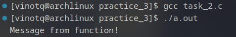

# Задание 2.
### Дан код:

``` c
#include <stdio.h>
#include <stdlib.h>

// Глобальные переменные
int global_var = 42; 
int uninitialized_global_var; 

// Статическая переменная
static int static_var = 10;

// Структура
struct Point {
    int x;
    int y;
};

struct Point global_point = {1, 2};

// Функция
void print_message() {
    static int static_local_var = 5;
    int local_var = 3;
    printf("Message from function!\n");
}

int main() {
    int auto_var = 100;
    int *dynamic_var = malloc(4);
    if (dynamic_var) {
        *dynamic_var = 200;
    }

    struct Point stack_point = {3, 4};

    print_message();

    free(dynamic_var); 

    return 0;
}

```

### Нужно ответить на вопросы:
1. В каком сегменте ELF-файла будет находиться `global_var`?
1. В каком сегменте ELF-файла будет храниться `uninitialized_global_var`?
1. В каком сегменте находится `static_var`?
1. Где будет размещена `global_point`?
1. Где будут расположены:
    1. `local_var` из функции `print_message`?
    1. `static_local_var` из той же функции?
1. Где будет храниться `auto_var` из функции `main`?
1. Где будет выделена память для `dynamic_var`?
1. Где будет создана `stack_point`?

#### Ход работы:
  
**Рисунок 1**. Результат компиляции и запуска программы

    [vinotq@archlinux practice_3]$ objdump -t a.out 

    a.out:     формат файла elf64-x86-64

    SYMBOL TABLE:
    0000000000000000 l    df *ABS*  0000000000000000              task_2.c
    000000000000402c l     O .data  0000000000000004              static_var
    0000000000004038 l     O .data  0000000000000004              static_local_var.0
    0000000000000000 l    df *ABS*  0000000000000000              
    0000000000003de0 l     O .dynamic       0000000000000000              _DYNAMIC
    000000000000201c l       .eh_frame_hdr  0000000000000000              __GNU_EH_FRAME_HDR
    0000000000003fe8 l     O .got.plt       0000000000000000              _GLOBAL_OFFSET_TABLE_
    0000000000000000       F *UND*  0000000000000000              free@GLIBC_2.2.5
    0000000000000000       F *UND*  0000000000000000              __libc_start_main@GLIBC_2.34
    0000000000000000  w      *UND*  0000000000000000              _ITM_deregisterTMCloneTable
    0000000000004018  w      .data  0000000000000000              data_start
    0000000000000000       F *UND*  0000000000000000              puts@GLIBC_2.2.5
    000000000000403c g       .data  0000000000000000              _edata
    00000000000011d4 g     F .fini  0000000000000000              .hidden _fini
    0000000000001159 g     F .text  0000000000000021              print_message
    0000000000004028 g     O .data  0000000000000004              global_var
    0000000000004018 g       .data  0000000000000000              __data_start
    0000000000000000  w      *UND*  0000000000000000              __gmon_start__
    0000000000004020 g     O .data  0000000000000000              .hidden __dso_handle
    0000000000002000 g     O .rodata        0000000000000004              _IO_stdin_used
    0000000000004040 g     O .bss   0000000000000004              uninitialized_global_var
    0000000000000000       F *UND*  0000000000000000              malloc@GLIBC_2.2.5
    0000000000004048 g       .bss   0000000000000000              _end
    0000000000001060 g     F .text  0000000000000026              _start
    000000000000403c g       .bss   0000000000000000              __bss_start
    000000000000117a g     F .text  0000000000000059              main
    0000000000004040 g     O .data  0000000000000000              .hidden __TMC_END__
    0000000000000000  w      *UND*  0000000000000000              _ITM_registerTMCloneTable
    0000000000000000  w    F *UND*  0000000000000000              __cxa_finalize@GLIBC_2.2.5
    0000000000001000 g     F .init  0000000000000000              .hidden _init
    0000000000004030 g     O .data  0000000000000008              global_point
**Область вывода 1**. Поиск ответов на вопросы при помощи `objdump -t a.out`

# Ответы:
1. В каком сегменте ELF-файла будет находиться `global_var`?
    **Ответ**: в сегменте даты (Data)
1. В каком сегменте ELF-файла будет храниться `uninitialized_global_var`? 
    **Ответ**: в сегменте даты (Data), но не инициализированной (BSS)
1. В каком сегменте находится `static_var`?  
    **Ответ**: в сегменте даты
1. Где будет размещена `global_point`?  
    **Ответ**: в сегменте даты` 
1. Где будут расположены:  
    1. `local_var` из функции `print_message`?  
        **Ответ**: сегмент стека
    1. `static_local_var` из той же функции?  
        **Ответ**: в сегменте даты 
1. Где будет храниться `auto_var` из функции `main`?
    **Ответ**: сегмент стека
1. Где будет выделена память для `dynamic_var`?  
    **Ответ**: сегмент кучи
1. Где будет создана `stack_point`?  
    **Ответ**: сегмент стека