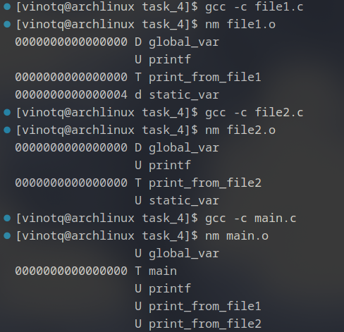
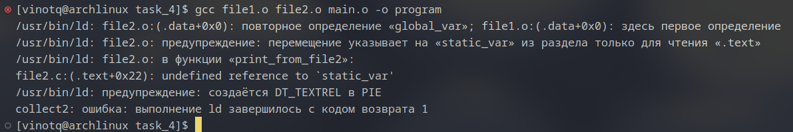
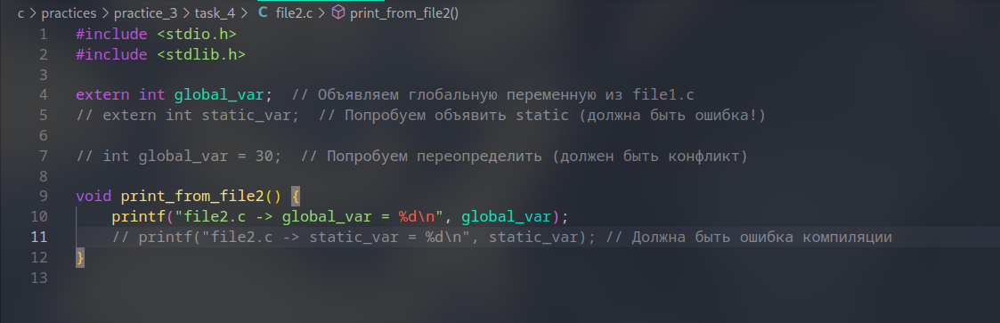
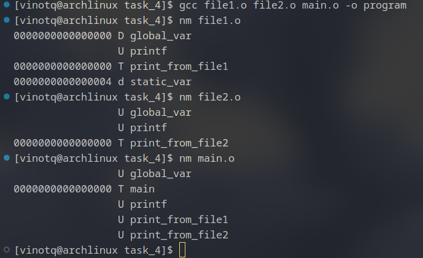
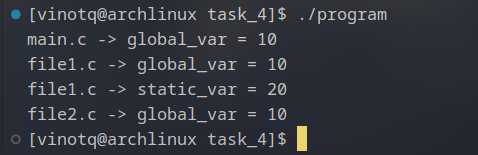
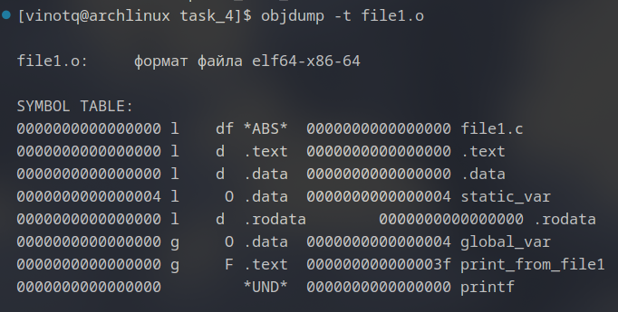
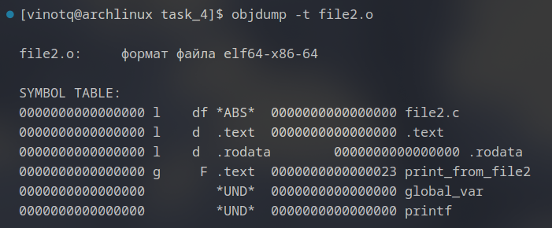
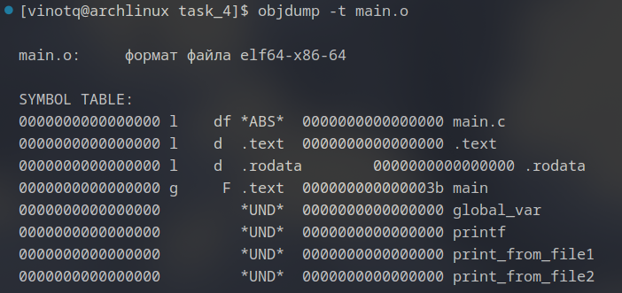
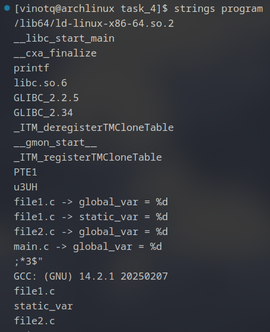

# Основная часть

    
**Рисунок 1**. Результат компиляции `gcc -c file1.c file2.c main.c` и `nm` для каждого полученного файла

## Анализ:
* в `file1.o` видны `global_var` и `static_var`
* в `file2.o` видны `global_var` и `static_var`, но последний имеет флаг U => еще не знаем что это такое
* в `main.o` виден только `global_var`, у него так же стоит U => тоже непонятная (пока) вещь  

___

  
**Рисунок 2**. Результат компиляции `gcc file1.o file2.o main.o -o program`. как и ожидалось - ошибка из-за `global_var` и `static_var`

___

  
**Рисунок 3**. Исправленный файл `file2.c`

___

  
**Рисунок 4.1**. Перекомпиляция прошла успешно  

  
**Рисунок 4.2**. Программа работает

___

  
**Рисунок 5**. `objdump -t file1.o`

  
**Рисунок 6**. `objdump -t file2.o`

  
**Рисунок 7**. `objdump -t main.o`

## Анализ:
* в `objdump -t file1.o` для `file1.o` `.bss` отсутствует, `.data` находтся в сегменте `0000000000000000`, а `.text` - в аналогичном сегменте `0000000000000000`
* в `objdump -t file2.o` для `file2.o` `.bss` снова отсутствует, `.data` отсутствует, а `.text` снова в сегменте `0000000000000000`
* в `objdump -t main.o` для `main.o` `.bss` аналогично отсутствует, `.data` снова отсутствует, а `.text` опять в сегменте `0000000000000000`

___
  
**Рисунок 8**. `strings program` и наличие строк из `printf()`

# Дополнительные шаги
    [vinotq@archlinux task_4]$ objdump -x program

    program:     формат файла elf64-x86-64
    program
    архитектура: i386:x86-64, флаги 0x00000150:
    HAS_SYMS, DYNAMIC, D_PAGED
    начальный адрес 0x0000000000001040

    Заголовок программы:
        PHDR off    0x0000000000000040 vaddr 0x0000000000000040 paddr 0x0000000000000040 align 2**3
            filesz 0x0000000000000310 memsz 0x0000000000000310 flags r--
    INTERP off    0x00000000000003b4 vaddr 0x00000000000003b4 paddr 0x00000000000003b4 align 2**0
            filesz 0x000000000000001c memsz 0x000000000000001c flags r--
        LOAD off    0x0000000000000000 vaddr 0x0000000000000000 paddr 0x0000000000000000 align 2**12
            filesz 0x0000000000000640 memsz 0x0000000000000640 flags r--
        LOAD off    0x0000000000001000 vaddr 0x0000000000001000 paddr 0x0000000000001000 align 2**12
            filesz 0x00000000000001e5 memsz 0x00000000000001e5 flags r-x
        LOAD off    0x0000000000002000 vaddr 0x0000000000002000 paddr 0x0000000000002000 align 2**12
            filesz 0x0000000000000184 memsz 0x0000000000000184 flags r--
        LOAD off    0x0000000000002dd0 vaddr 0x0000000000003dd0 paddr 0x0000000000003dd0 align 2**12
            filesz 0x0000000000000250 memsz 0x0000000000000258 flags rw-
    DYNAMIC off    0x0000000000002de0 vaddr 0x0000000000003de0 paddr 0x0000000000003de0 align 2**3
            filesz 0x00000000000001e0 memsz 0x00000000000001e0 flags rw-
        NOTE off    0x0000000000000350 vaddr 0x0000000000000350 paddr 0x0000000000000350 align 2**3
            filesz 0x0000000000000040 memsz 0x0000000000000040 flags r--
        NOTE off    0x0000000000000390 vaddr 0x0000000000000390 paddr 0x0000000000000390 align 2**2
            filesz 0x0000000000000024 memsz 0x0000000000000024 flags r--
        NOTE off    0x0000000000002164 vaddr 0x0000000000002164 paddr 0x0000000000002164 align 2**2
            filesz 0x0000000000000020 memsz 0x0000000000000020 flags r--
    0x6474e553 off    0x0000000000000350 vaddr 0x0000000000000350 paddr 0x0000000000000350 align 2**3
            filesz 0x0000000000000040 memsz 0x0000000000000040 flags r--
    EH_FRAME off    0x0000000000002074 vaddr 0x0000000000002074 paddr 0x0000000000002074 align 2**2
            filesz 0x0000000000000034 memsz 0x0000000000000034 flags r--
    STACK off    0x0000000000000000 vaddr 0x0000000000000000 paddr 0x0000000000000000 align 2**4
            filesz 0x0000000000000000 memsz 0x0000000000000000 flags rw-
    RELRO off    0x0000000000002dd0 vaddr 0x0000000000003dd0 paddr 0x0000000000003dd0 align 2**0
            filesz 0x0000000000000230 memsz 0x0000000000000230 flags r--

    Динамический раздел:
    NEEDED               libc.so.6
    INIT                 0x0000000000001000
    FINI                 0x00000000000011d8
    INIT_ARRAY           0x0000000000003dd0
    INIT_ARRAYSZ         0x0000000000000008
    FINI_ARRAY           0x0000000000003dd8
    FINI_ARRAYSZ         0x0000000000000008
    GNU_HASH             0x00000000000003d0
    STRTAB               0x0000000000000498
    SYMTAB               0x00000000000003f0
    STRSZ                0x000000000000008f
    SYMENT               0x0000000000000018
    DEBUG                0x0000000000000000
    PLTGOT               0x0000000000003fe8
    PLTRELSZ             0x0000000000000018
    PLTREL               0x0000000000000007
    JMPREL               0x0000000000000628
    RELA                 0x0000000000000568
    RELASZ               0x00000000000000c0
    RELAENT              0x0000000000000018
    FLAGS_1              0x0000000008000000
    VERNEED              0x0000000000000538
    VERNEEDNUM           0x0000000000000001
    VERSYM               0x0000000000000528
    RELACOUNT            0x0000000000000003

    Версии ссылок:
    требуется из libc.so.6:
        0x09691a75 0x00 03 GLIBC_2.2.5
        0x069691b4 0x00 02 GLIBC_2.34

    Разделы:
    Idx Name          Разм      VMA               LMA               Фа  смещ.  Выр.
    0 .note.gnu.property 00000040  0000000000000350  0000000000000350  00000350  2**3
                    CONTENTS, ALLOC, LOAD, READONLY, DATA
    1 .note.gnu.build-id 00000024  0000000000000390  0000000000000390  00000390  2**2
                    CONTENTS, ALLOC, LOAD, READONLY, DATA
    2 .interp       0000001c  00000000000003b4  00000000000003b4  000003b4  2**0
                    CONTENTS, ALLOC, LOAD, READONLY, DATA
    3 .gnu.hash     0000001c  00000000000003d0  00000000000003d0  000003d0  2**3
                    CONTENTS, ALLOC, LOAD, READONLY, DATA
    4 .dynsym       000000a8  00000000000003f0  00000000000003f0  000003f0  2**3
                    CONTENTS, ALLOC, LOAD, READONLY, DATA
    5 .dynstr       0000008f  0000000000000498  0000000000000498  00000498  2**0
                    CONTENTS, ALLOC, LOAD, READONLY, DATA
    6 .gnu.version  0000000e  0000000000000528  0000000000000528  00000528  2**1
                    CONTENTS, ALLOC, LOAD, READONLY, DATA
    7 .gnu.version_r 00000030  0000000000000538  0000000000000538  00000538  2**3
                    CONTENTS, ALLOC, LOAD, READONLY, DATA
    8 .rela.dyn     000000c0  0000000000000568  0000000000000568  00000568  2**3
                    CONTENTS, ALLOC, LOAD, READONLY, DATA
    9 .rela.plt     00000018  0000000000000628  0000000000000628  00000628  2**3
                    CONTENTS, ALLOC, LOAD, READONLY, DATA
    10 .init         0000001b  0000000000001000  0000000000001000  00001000  2**2
                    CONTENTS, ALLOC, LOAD, READONLY, CODE
    11 .plt          00000020  0000000000001020  0000000000001020  00001020  2**4
                    CONTENTS, ALLOC, LOAD, READONLY, CODE
    12 .text         00000196  0000000000001040  0000000000001040  00001040  2**4
                    CONTENTS, ALLOC, LOAD, READONLY, CODE
    13 .fini         0000000d  00000000000011d8  00000000000011d8  000011d8  2**2
                    CONTENTS, ALLOC, LOAD, READONLY, CODE
    14 .rodata       00000073  0000000000002000  0000000000002000  00002000  2**2
                    CONTENTS, ALLOC, LOAD, READONLY, DATA
    15 .eh_frame_hdr 00000034  0000000000002074  0000000000002074  00002074  2**2
                    CONTENTS, ALLOC, LOAD, READONLY, DATA
    16 .eh_frame     000000bc  00000000000020a8  00000000000020a8  000020a8  2**3
                    CONTENTS, ALLOC, LOAD, READONLY, DATA
    17 .note.ABI-tag 00000020  0000000000002164  0000000000002164  00002164  2**2
                    CONTENTS, ALLOC, LOAD, READONLY, DATA
    18 .init_array   00000008  0000000000003dd0  0000000000003dd0  00002dd0  2**3
                    CONTENTS, ALLOC, LOAD, DATA
    19 .fini_array   00000008  0000000000003dd8  0000000000003dd8  00002dd8  2**3
                    CONTENTS, ALLOC, LOAD, DATA
    20 .dynamic      000001e0  0000000000003de0  0000000000003de0  00002de0  2**3
                    CONTENTS, ALLOC, LOAD, DATA
    21 .got          00000028  0000000000003fc0  0000000000003fc0  00002fc0  2**3
                    CONTENTS, ALLOC, LOAD, DATA
    22 .got.plt      00000020  0000000000003fe8  0000000000003fe8  00002fe8  2**3
                    CONTENTS, ALLOC, LOAD, DATA
    23 .data         00000018  0000000000004008  0000000000004008  00003008  2**3
                    CONTENTS, ALLOC, LOAD, DATA
    24 .bss          00000008  0000000000004020  0000000000004020  00003020  2**0
                    ALLOC
    25 .comment      0000001b  0000000000000000  0000000000000000  00003020  2**0
                    CONTENTS, READONLY
    SYMBOL TABLE:
    0000000000000000 l    df *ABS*  0000000000000000              file1.c
    000000000000401c l     O .data  0000000000000004              static_var
    0000000000000000 l    df *ABS*  0000000000000000              file2.c
    0000000000000000 l    df *ABS*  0000000000000000              main.c
    0000000000000000 l    df *ABS*  0000000000000000              
    0000000000003de0 l     O .dynamic       0000000000000000              _DYNAMIC
    0000000000002074 l       .eh_frame_hdr  0000000000000000              __GNU_EH_FRAME_HDR
    0000000000003fe8 l     O .got.plt       0000000000000000              _GLOBAL_OFFSET_TABLE_
    0000000000000000       F *UND*  0000000000000000              __libc_start_main@GLIBC_2.34
    0000000000000000  w      *UND*  0000000000000000              _ITM_deregisterTMCloneTable
    0000000000004008  w      .data  0000000000000000              data_start
    0000000000001178 g     F .text  0000000000000023              print_from_file2
    0000000000004020 g       .data  0000000000000000              _edata
    00000000000011d8 g     F .fini  0000000000000000              .hidden _fini
    0000000000000000       F *UND*  0000000000000000              printf@GLIBC_2.2.5
    0000000000004018 g     O .data  0000000000000004              global_var
    0000000000004008 g       .data  0000000000000000              __data_start
    0000000000000000  w      *UND*  0000000000000000              __gmon_start__
    0000000000004010 g     O .data  0000000000000000              .hidden __dso_handle
    0000000000002000 g     O .rodata        0000000000000004              _IO_stdin_used
    0000000000004028 g       .bss   0000000000000000              _end
    0000000000001040 g     F .text  0000000000000026              _start
    0000000000001139 g     F .text  000000000000003f              print_from_file1
    0000000000004020 g       .bss   0000000000000000              __bss_start
    000000000000119b g     F .text  000000000000003b              main
    0000000000004020 g     O .data  0000000000000000              .hidden __TMC_END__
    0000000000000000  w      *UND*  0000000000000000              _ITM_registerTMCloneTable
    0000000000000000  w    F *UND*  0000000000000000              __cxa_finalize@GLIBC_2.2.5
    0000000000001000 g     F .init  0000000000000000              .hidden _init

**Область вывода 1**. Вывод `objdump -x program`

## Анализ:
Почитав вывод, я выделил следующие *интересные* пункты:
* Начальный адрес выполнения: `0000000000001040` – точка входа в программу (определена по пункту `_start`).

* Исполняемый код:
    * `.init`(`1000`) – инициализационный код.
    * `.text` (`1040`) – основная секция кода.

* Данные:
    * `.rodata` (`2000`) – неизменяемые данные
    * `.data` (`4008`) – инициализированные переменные
    * `.bss` (`4020`) – неинициализированные переменные (вот и нашелся `.bss`)

* `main` (`119b`) – наша главная функция
* `print_from_file1` (`1139`) и `print_from_file2` (`1178`) – функции из наших файлов
* `global_var` (`4018`) – наша глобальная переменная

        Версии ссылок:
        требуется из libc.so.6:
            0x09691a75 0x00 03 GLIBC_2.2.5
            0x069691b4 0x00 02 GLIBC_2.34
    **Область вывода 2**. Требуемые библиотеки
___  

    SYMBOL TABLE:
    0000000000000000 l    df *ABS*  0000000000000000              file1.c
    000000000000401c l     O .data  0000000000000004              static_var
    0000000000000000 l    df *ABS*  0000000000000000              file2.c
    0000000000000000 l    df *ABS*  0000000000000000              main.c
    0000000000000000 l    df *ABS*  0000000000000000              
    0000000000003de0 l     O .dynamic       0000000000000000              _DYNAMIC
    0000000000002074 l       .eh_frame_hdr  0000000000000000              __GNU_EH_FRAME_HDR
    0000000000003fe8 l     O .got.plt       0000000000000000              _GLOBAL_OFFSET_TABLE_
    0000000000000000       F *UND*  0000000000000000              __libc_start_main@GLIBC_2.34
    0000000000000000  w      *UND*  0000000000000000              _ITM_deregisterTMCloneTable
    0000000000004008  w      .data  0000000000000000              data_start
    0000000000001178 g     F .text  0000000000000023              print_from_file2
    0000000000004020 g       .data  0000000000000000              _edata
    00000000000011d8 g     F .fini  0000000000000000              .hidden _fini
    0000000000000000       F *UND*  0000000000000000              printf@GLIBC_2.2.5
    0000000000004018 g     O .data  0000000000000004              global_var
    0000000000004008 g       .data  0000000000000000              __data_start
    0000000000000000  w      *UND*  0000000000000000              __gmon_start__
    0000000000004010 g     O .data  0000000000000000              .hidden __dso_handle
    0000000000002000 g     O .rodata        0000000000000004              _IO_stdin_used
    0000000000004028 g       .bss   0000000000000000              _end
    0000000000001040 g     F .text  0000000000000026              _start
    0000000000001139 g     F .text  000000000000003f              print_from_file1
    0000000000004020 g       .bss   0000000000000000              __bss_start
    000000000000119b g     F .text  000000000000003b              main
    0000000000004020 g     O .data  0000000000000000              .hidden __TMC_END__
    0000000000000000  w      *UND*  0000000000000000              _ITM_registerTMCloneTable
    0000000000000000  w    F *UND*  0000000000000000              __cxa_finalize@GLIBC_2.2.5
    0000000000001000 g     F .init  0000000000000000              .hidden _init
**Область вывода 3**. Таблица символов после статической компиляции (`gcc -static file1.c file2.c main.c`)

## Ответ на вопрос: 
    "Почему global_var есть в .data, а static_var нет в таблице символов?"
Все потому, что `global_var` объявлена без `static`, а значит у нее другой тип связывания - [**внешний**](https://ru.stackoverflow.com/questions/490548/%D0%A7%D1%82%D0%BE-%D1%82%D0%B0%D0%BA%D0%BE%D0%B5-%D0%B2%D0%BD%D1%83%D1%82%D1%80%D0%B5%D0%BD%D0%BD%D0%B5%D0%B5-%D0%B8-%D0%B2%D0%BD%D0%B5%D1%88%D0%BD%D0%B5%D0%B5-%D1%81%D0%B2%D1%8F%D0%B7%D1%8B%D0%B2%D0%B0%D0%BD%D0%B8%D0%B5 "Это напоминалка для меня"), значит она будет видна и в других объектах программы. Более того, судя по тому, что я прочитал, `static` не включаются в таблицу символов, ведь они не нужны в основной программе, а нужны локально